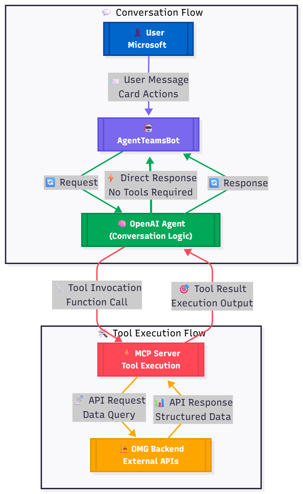

# OMG Teams Bot with Agent & MCP Integration

An intelligent Microsoft Teams bot powered by **OpenAI’s Agents SDK** and **Model Context Protocol (MCP)** that enables users to manage tasks, authenticate, and navigate the OMG project management system seamlessly from within Teams.

---

## 🚀 Features

* **Intelligent Agent** — Uses OpenAI’s Agents SDK to interpret user intent and decide when to use MCP tools vs. general knowledge.
* **MCP Tool Integration** — Bridges to OMG backend for actions like authentication, task creation, and site switching.
* **Adaptive Cards** — Rich interactive cards for login, task management, and site selection.
* **Persistent Session Management** — Maintains user sessions and authentication state using SQLite-based storage.
* **Multi-turn Conversations** — Context-aware dialogues that remember prior interactions.

---

## 🧩 Architecture



### 🔁 Flow Summary

1. **User → Teams → Bot:**
   User sends a message or interacts with an adaptive card.

2. **Bot ↔ OpenAI Agent:**
   The `AgentTeamsBot` forwards the message to the OpenAI Agent.
   The Agent processes context and streams responses back to the bot.

3. **Agent Tool Decision:**

   * If **no tool is needed**, the Agent directly responds with a message or card to Teams.
   * If a **tool is needed**, it calls the relevant MCP tool (e.g., `login`, `create_task`, `switch_site`).

4. **MCP Server ↔ OMG Backend:**
   The MCP server communicates bidirectionally with the OMG backend APIs to perform the requested operation and return structured data.

5. **Agent → Bot → Teams:**
   The Agent formats the tool’s result into a conversational or card-based reply, and the bot posts it back to Teams.

---

## ⚙️ Setup

### 1. Install Dependencies

```bash
pip install -r requirements.txt
```

### 2. Configure Environment Variables

Set up the following variables in your `.env` file:

| Variable                  | Description                                |
| ------------------------- | ------------------------------------------ |
| `MICROSOFT_APP_ID`        | Azure App Registration ID for the bot      |
| `MICROSOFT_APP_PASSWORD`  | Bot’s client secret                        |
| `MICROSOFT_APP_TENANT_ID` | Azure AD tenant ID                         |
| `OPENAI_API_KEY`          | API key for OpenAI Agent                   |
| `BOT_PORT`                | Port to run the bot server (default: 8000) |
| `BASE_URL`                | OMG backend API URL                        |
| `LOGIN_BASE_URL`          | OMG login endpoint                         |
| `APP_BASE_URL`            | Public URL (e.g., ngrok tunnel)            |

---

### 3. Run the Bot

```bash
cd bot_app
python main.py
```

The bot will:

1. Start the MCP server.
2. Load system instructions from `prompts/system_instructions.md`.
3. Initialize the OpenAI Agent with MCP tools.
4. Launch the Teams bot on the configured port.

---

### 4. Expose the Bot to the Internet

Use `ngrok` or similar to make your bot accessible:

```bash
ngrok http 8000
```

Then update `APP_BASE_URL` in your `.env` file with the generated public URL.

---

### 5. Configure Azure Bot Service

1. Go to **Azure Portal → Bot Services → Your Bot**
2. Update the **Messaging endpoint** to:

   ```
   https://your-ngrok-url.ngrok-free.app/api/messages
   ```
3. Save changes.

---

## 💬 Usage

### 🔐 Authentication

**User:** “Log me in”
→ The bot presents a login card. After authentication, the Agent confirms the user’s site and profile.

### 🧱 Task Management

**User:** “Create a task called Website Redesign due tomorrow”
→ The Agent extracts details, fills a card, requests confirmation, and then creates the task via MCP.

### 🏢 Site Switching

**User:** “Switch to the London site”
→ The Agent lists available sites and switches the current context upon selection.

### 🧠 General Queries

**User:** “How do I track project progress?”
→ The Agent responds using general knowledge when no tool is needed.

---

## 🗂️ Project Structure

```
bot_app/
├── main.py                 # Application entry point
├── agent_bot.py            # Bot logic and event handling
├── mcp_server.py           # MCP tools for OMG backend
├── cards.py                # Adaptive Card factories
├── config.py               # Configuration and environment
├── session_manager.py      # SQLite-based session storage
└── prompts/
    └── system_instructions.md  # Agent’s behavior and decision guide
```

---

## 🧠 Key Components

### **AgentTeamsBot (`agent_bot.py`)**

* Handles Teams messages, card actions, and streaming Agent responses
* Bridges between Teams and OpenAI Agent
* Updates user context and session state

### **OpenAI Agent**

* Parses intent and context
* Decides whether to invoke MCP tools
* Generates adaptive card prompts and conversational replies

### **MCP Server (`mcp_server.py`)**

* Provides tools callable by the Agent:

  * `login`
  * `get_user_and_company_info`
  * `get_available_sites`
  * `switch_site`
  * `create_task`
  * `logout`
* Communicates with the OMG backend bidirectionally

---

## 🧩 Conversation Flow Example

### **Creating a Task**

1. User: “Create a task for the marketing campaign.”
2. Agent: “Sure! Which project should I associate it with?”
3. User: “Project 7334.”
4. Agent: [Displays pre-filled task creation card]
5. User: [Submits the form]
6. Agent: [Shows task confirmation card with task ID & link]

### **Switching Sites**

1. User: “Switch to London office.”
2. Agent: [Calls `get_available_sites`]
3. Agent: [Shows dropdown selection card]
4. User: [Selects site]
5. Agent: [Displays updated company info]

---

## 🛠️ Development

### Adding a New MCP Tool

1. Create the function in `mcp_server.py` with `@mcp.tool()` decorator.
2. Add the tool mapping in `config.py` under `TOOL_CONFIG`.
3. (Optional) Create a new card factory in `cards.py`.
4. Update `system_instructions.md` if the Agent needs special handling.

### Modifying Agent Behavior

Edit `prompts/system_instructions.md` to refine:

* Intent detection logic
* Tool invocation rules
* Prompting style and tone

---

## 🧾 Troubleshooting

| Issue                       | Possible Fix                                                          |
| --------------------------- | --------------------------------------------------------------------- |
| **Bot not responding**      | Ensure `main.py` is running and `ngrok` tunnel is active              |
| **MCP tools failing**       | Verify backend URLs and authentication tokens in `.env`               |
| **Agent not calling tools** | Confirm `system_instructions.md` is loaded and `mcp_server` is active |
| **Login errors**            | Check credentials and MCP tool response for debugging                 |

---

## 📜 License

**Proprietary** — Part of the OMG Project Management System.

---
